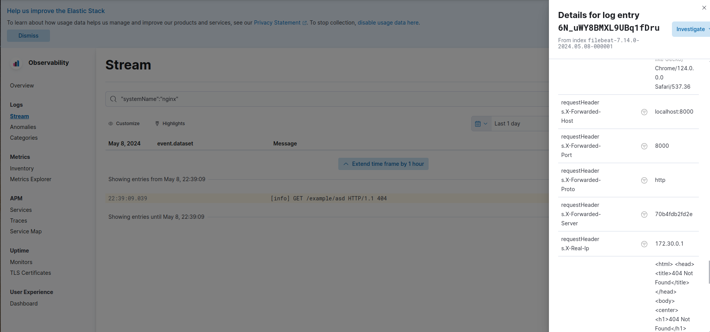
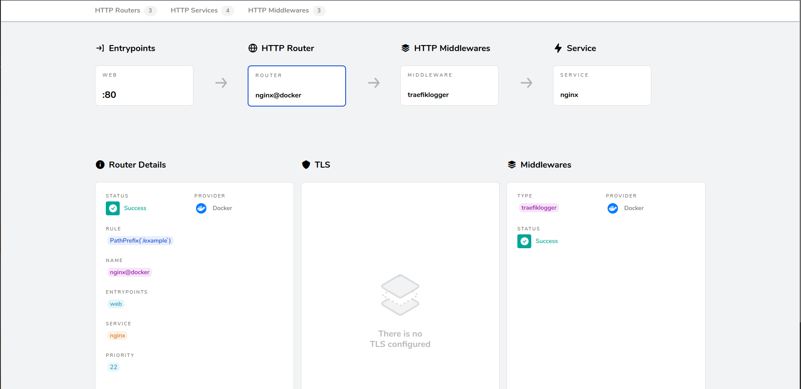

## Github

https://github.com/peace0phmind/log2fuse/tree/main/docker

## Start services
Execute this command **from this directory** to start the example services:

`docker compose up -d`

## Call nginx

Open from browser:

http://localhost:8000/example

Or use command line curl:

`curl http://127.0.0.1:8000/example`

## Watch logs

Execute this command **from this directory**:

`docker compose logs -f traefik`

### You will see something like this

#### in case of `text` format

```
traefik-1  | [nginx] 2024/05/05 19:52:41 172.21.0.1:56300 GET /example: 404 Not Found HTTP/1.1
traefik-1  | 
traefik-1  | Request Headers:
traefik-1  | X-Forwarded-Proto: http
traefik-1  | X-Forwarded-Port: 8000
traefik-1  | X-Forwarded-Host: 127.0.0.1:8000
traefik-1  | X-Forwarded-Server: 2f410295c1c0
traefik-1  | X-Real-Ip: 172.21.0.1
traefik-1  | User-Agent: curl/7.81.0
traefik-1  | Accept: */*
traefik-1  | 
traefik-1  | Response Headers:
traefik-1  | Content-Type: text/html
traefik-1  | Server: nginx/1.25.5
traefik-1  | Date: Sun, 05 May 2024 19:52:41 GMT
traefik-1  | Content-Length: 153
traefik-1  | 
traefik-1  | Response Content Length: 153
traefik-1  | 
traefik-1  | Response Body:
traefik-1  | <html>
traefik-1  | <head><title>404 Not Found</title></head>
traefik-1  | <body>
traefik-1  | <center><h1>404 Not Found</h1></center>
traefik-1  | <hr><center>nginx/1.25.5</center>
traefik-1  | </body>
traefik-1  | </html>
traefik-1  | 
traefik-1  | 
```

#### in case of `json` format

```json
{
  "log.level":"info",
  "@timestamp":"2024-05-08T19:43:13.097Z",
  "log.origin":{
    "file.name":"loggerjson.go",
    "file.line":1
  },
  "message":"GET /example HTTP/1.1 404",
  "systemName":"nginx",
  "remoteAddress":"172.25.0.1:52688",
  "method":"GET",
  "path":"/example",
  "status":404,
  "statusText":"Not Found",
  "proto":"HTTP/1.1",
  "requestHeaders":{
    "Accept":[
      "text/html,application/xhtml+xml,application/xml;q=0.9,image/avif,image/webp,image/apng,*/*;q=0.8,application/signed-exchange;v=b3;q=0.7"
    ],
    "Accept-Encoding":[
      "gzip, deflate, br, zstd"
    ],
    "Accept-Language":[
      "hu-HU,hu;q=0.9,en-GB;q=0.8,en;q=0.7,de-DE;q=0.6,de;q=0.5,uk-UA;q=0.4,uk;q=0.3,en-US;q=0.2"
    ],
    "Cache-Control":[
      "max-age=0"
    ],
    "Connection":[
      "keep-alive"
    ],
    "Sec-Ch-Ua":[
      "\"Chromium\";v=\"124\", \"Google Chrome\";v=\"124\", \"Not-A.Brand\";v=\"99\""
    ],
    "Sec-Ch-Ua-Mobile":[
      "?0"
    ],
    "Sec-Ch-Ua-Platform":[
      "\"Linux\""
    ],
    "Sec-Fetch-Dest":[
      "document"
    ],
    "Sec-Fetch-Mode":[
      "navigate"
    ],
    "Sec-Fetch-Site":[
      "none"
    ],
    "Sec-Fetch-User":[
      "?1"
    ],
    "Upgrade-Insecure-Requests":[
      "1"
    ],
    "User-Agent":[
      "Mozilla/5.0 (X11; Linux x86_64) AppleWebKit/537.36 (KHTML, like Gecko) Chrome/124.0.0.0 Safari/537.36"
    ],
    "X-Forwarded-Host":[
      "localhost:8000"
    ],
    "X-Forwarded-Port":[
      "8000"
    ],
    "X-Forwarded-Proto":[
      "http"
    ],
    "X-Forwarded-Server":[
      "57b0a82866d0"
    ],
    "X-Real-Ip":[
      "172.25.0.1"
    ]
  },
  "responseHeaders":{
    "Content-Length":[
      "555"
    ],
    "Content-Type":[
      "text/html"
    ],
    "Date":[
      "Wed, 08 May 2024 19:43:13 GMT"
    ],
    "Server":[
      "nginx/1.25.5"
    ]
  },
  "responseContentLength":555,
  "responseBody":"\u003chtml\u003e\r\n\u003chead\u003e\u003ctitle\u003e404 Not Found\u003c/title\u003e\u003c/head\u003e\r\n\u003cbody\u003e\r\n\u003ccenter\u003e\u003ch1\u003e404 Not Found\u003c/h1\u003e\u003c/center\u003e\r\n\u003chr\u003e\u003ccenter\u003enginx/1.25.5\u003c/center\u003e\r\n\u003c/body\u003e\r\n\u003c/html\u003e\r\n\u003c!-- a padding to disable MSIE and Chrome friendly error page --\u003e\r\n\u003c!-- a padding to disable MSIE and Chrome friendly error page --\u003e\r\n\u003c!-- a padding to disable MSIE and Chrome friendly error page --\u003e\r\n\u003c!-- a padding to disable MSIE and Chrome friendly error page --\u003e\r\n\u003c!-- a padding to disable MSIE and Chrome friendly error page --\u003e\r\n\u003c!-- a padding to disable MSIE and Chrome friendly error page --\u003e\r\n",
  "ecs.version":"1.6.0"
}
```

## Elasticsearch

- Open Kibana from browser: http://localhost:5601/
- Select Stream (under the Logs section)
- Type into search: `"systemName":"nginx"`
  (optional)
- You can see the date-time, log level and the `message` field of each log entry.
- On the detail panel you can find each attribute (like request/response body, headers).



## Traefik dashboard

You can check the active middleware on the dasboard.


